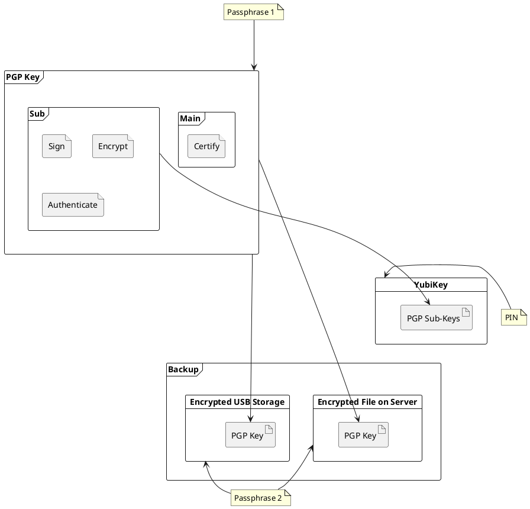

# Topics

- [PGP Key *Generate keys, create a secure backup and use it with a YubiKey.*](/digital_privacy/pgp)
- [Yubikey 5 NFC *Add personal credentials and set a pin.*](/digital_privacy/yubikey)
- [Encrypt File with GPG *Encrypt a file with GPG and secure it with a passphrase.*](/digital_privacy/encrypt_file_with_gpg)
- [Encrypted Thumb Drive *Setup an encrypted thumb drive and secure it with a passphrase.*](/digital_privacy/excrypted_thumbdrive)
{.links-list}

# My Setup

I store my keys onto the YubiKey for daily use but I keep backups in case my YubiKey gets damaged or lost, as this will result in data loss and the hassle of creating and distributing new keys to all devices and services.

Here I'll show how I setup my keys, create backups and then move them to the YubiKey.

> It is possible to create the keys directly on the YubiKey but then it is impossible to create a backup.
{.is-info}

My *PGP Key* is secured with a passphrase and consists of four parts.

- **Main** Certificate 
    - **Sub** Signing
    - **Sub** Encryption
    - **Sub** Authentication
    
The Yubikey holds only the *Sub-Keys* and is protected with a *PIN* which will lock the Yubikey if entered wrong three times in a row.

A second passphrase secures my backup. I desiced to use two backup solutions simultaneously.

- Encrypted USB Thumbdrive
- Encrypted Archive in my private Cloud

