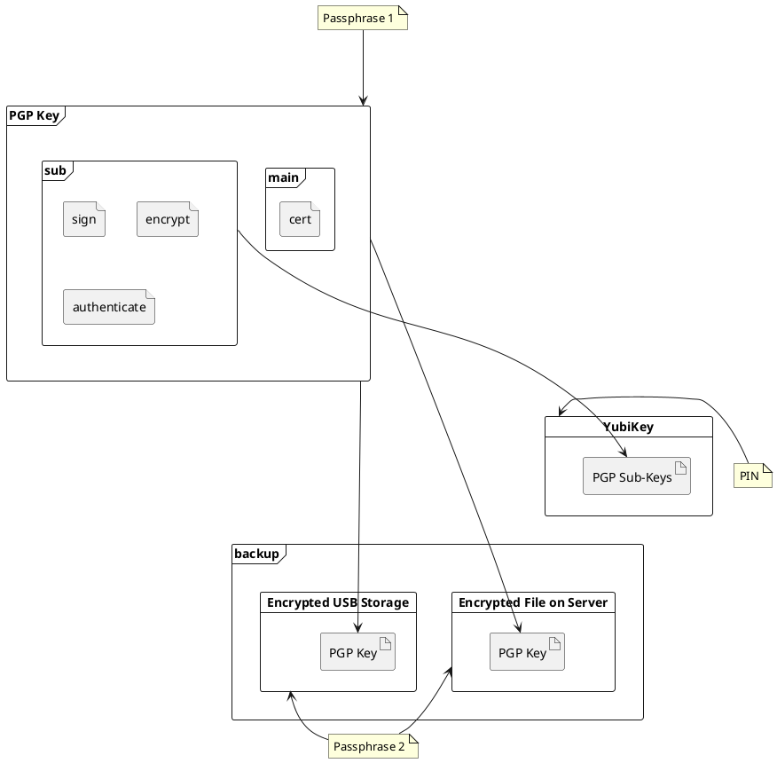

# Overview

The goal is to store the keys onto the YubiKey for daily use.

It is possible to create the keys directly on the YubiKey but then we won't be able to hold a backup. In case your YubiKey gets damaged or lost, this will result in potential data loss and the hassle of updating all your services and devices to use the new key.

I'll show you how to setup the keys on a PC, create backups and then move them to the YubiKey.



What we are looking for is a combination of 4 Keys.

- **Main** Certificate 
    - **Sub** Signing
    - **Sub** Encryption
    - **Sub** Authentication

The user identification will be assosiated with the main key. Your `uid` contains the full name the assosiated email as well as an optional comment. A listing of a key as printed by gpg may look like this:

```
pub   rsa4096/ABCDEF1234567890 2021-01-01 [C] [expires: 2022-01-01]
      1234567890ABCDEF1234567890ABCDEF12345678
uid           [ultimate] User Name <user.name@company.email>
uid           [ultimate] User Name (Nickname) <nickname@other.email>
sub   rsa4096/BCDEF1234567890A 2021-01-01 [S] [expires: 2022-01-01]
sub   rsa4096/CDEF1234567890AB 2021-01-01 [E] [expires: 2022-01-01]
sub   rsa4096/DEF1234567890ABC 2021-01-01 [A] [expires: 2022-01-01]
```


# Create Keys


## Main Key

Start the key generation process with `gpg --full-generate-key`. We are going for a custom way of organizing keys which differs from the default options. Go for the expert mode by adding the `--expert` parameter.

```
$ gpg --full-generate-key --expert
```

You should be prompted with the key type selection. Choose `RSA` with custom capabilities.

```
Please select what kind of key you want
...
(8) RSA (set your own capabilities)
...
Your selection? 8
```

The next part is a bit tricky. Now you can **toggle** the capabilities for the *main* key. Technically you could create *one key to do them all*. But I consider this a bad idea. Let's go for single-purpose-keys.

The only capability you can not toggle at this stage is `Certify`. Disable all other by **toggling** one at a time. Confirm each *toggle* in between. You should be typing a key combination like: `S`, `Return`, `E`, `Return`. Check the `Current allowed actions` to only contain `Certify` before finishing this stage with  `Q` and `Return`.

```
Possible actions for a RSA key: Sign Certify Encrypt Authenticate
Current allowed actions: Sign Certify Encrypt

   (S) Toggle the sign capability
   (E) Toggle the encrypt capability
   (A) Toggle the authenticate capability
   (Q) Finished

Your selection? s

...

Current allowed actions: Certify Encrypt
...
Your selection? e

...

Current allowed actions: Certify
...
Your selection? q
```

In the next stage you can choose the length of your key. Rule of thumb: *longer is better*. If you also have a `YubiKey 5` go for the max length of `4096` bits. If you have a different model, I recommend you to consult the data sheet for supported key length.

```
RSA keys may be between 1024 and 4096 bits long.
What keysize do you want? (3072) 4096
```

Even though you can revoke a key manually, it is considered *good practice* to let your key expire in less than two years. Don't worry, you can extend its life time even after the key has expired.  But consider you loose access to your main key or just stop using the key at all and forget about it. Let the key expire after `1y` (one year).

```
Please specify how long the key should be valid.
         0 = key does not expire
      <n>  = key expires in n days
      <n>w = key expires in n weeks
      <n>m = key expires in n months
      <n>y = key expires in n years
Key is valid for? (0) 1y
Key expires at Mi 05 Jan 2022 01:03:06 CET
Is this correct? (y/N) y
```

We are almost there. Now type in your identity, giving your real name and the email address you want to be associated with. A comment is optional and can be left empty. You can add further email addresses to your key later.

```
GnuPG needs to construct a user ID to identify your key.

Real name: Your Name
Email address: your.name@company.email
Comment: work
You selected this USER-ID:
    "Your Name (work) <your.name@company.email>"

Change (N)ame, (C)omment, (E)mail or (O)kay/(Q)uit? o
```

Finally choose a passphrase to protect your key. It should be fairly long as you are not using it on a daily basis. Just stick with common password best practices, write it down and hide it in your secret vault later. You will need this passphrase in the following steps.

Just make sure you have enough entropy during the key generation. Check your available entropy in an other terminal with `cat /proc/sys/kernel/random/entropy_avail`. On an average system it should be greater than `3000`. You can rise the entropy by using your system, moving the mouse and perform a faceroll over the keyboard during the key generation process. 

Once the key generation is done you will see the listing of your key including its fingerprint. In this example `C153F8B2CC34081E9091C71B195E33D069143FE5`, you will need this in the following steps.

Also you get a hint where the revocation certificate has been stored. Move it to a save place, like an encrypted USB drive that is kept offline. Anyone can use this revocation certificate to invalidate your key. So don't let it slip into fiendish hands. 

```
gpg: key 195E33D069143FE5 marked as ultimately trusted
gpg: revocation certificate stored as '/home/muro/.gnupg/openpgp-revocs.d/C153F8B2CC34081E9091C71B195E33D069143FE5.rev'
public and secret key created and signed.

pub   rsa4096 2021-01-05 [C] [expires: 2022-01-05]
      C153F8B2CC34081E9091C71B195E33D069143FE5
uid                      Your Name (work) <your.name@company.email>
```


## Sub Keys

There are three kind of keys we need to create. One for signing, one for encryption and one for authentication. The procedure is the same for all of them. And we begin with editing the key in expert mode.

```
$ gpg --edit-key --expert C153F8B2CC34081E9091C71B195E33D069143FE5
```

Adding another key is as simple as `addkey`. The following procedurese should look familiar to you as it's the same as for the primary key. Go for the `RSA` key with custom capabilities.

```
gpg> addkey

(8) RSA (set your own capabilities)
Your selection? 8
```

**Toggle** the capabilities so you create a diffrent key every time. In this example I start with `Authenticate`.

```
Possible actions for a RSA key: Sign Encrypt Authenticate 
Current allowed actions: Sign Encrypt 

   (S) Toggle the sign capability
   (E) Toggle the encrypt capability
   (A) Toggle the authenticate capability
   (Q) Finished
   
Your selection? e
Your selection? s
Your selection? a

Current allowed actions: Authenticate
Your selection? q
```

The key lengh should be as long as possible. Consider the supported key length of your security key if you intend to use one.
```
RSA keys may be between 1024 and 4096 bits long.
What keysize do you want? (3072) 4096
```

Set a reasonable expiration date.
```
Key is valid for? (0) 1y
Key expires at Mo 17 Jan 2022 00:02:47 CET
Is this correct? (y/N) y
Really create? (y/N) y
```

Et voilà, you successfully created the first sub key.
```
sec  rsa4096/195E33D069143FE5
     created: 2021-01-05  expires: 2022-01-05  usage: C   
...
ssb  rsa4096/8E15AB3040140A61
     created: 2021-01-16  expires: 2022-01-16  usage: A   
```

Now repeat the `addkey` procedure but this time **toggle** the capabilitiy to `Sign`.

```
Current allowed actions: Sign
```

Now repeat the `addkey` procedure but this time **toggle** the capabilitiy to `Encrypt`.

```
Current allowed actions: Encrypt
```

Finally don't forget to `save` your changes and check out your PGP key. You should end up with a `[C]ertify`, an `[A]uthenticate`, a `[S]ign` and an `[E]ncrypt` Key.

```
gpg> save

$ gpg -K

sec   rsa4096 2021-01-05 [C] [expires: 2022-01-05]
      C153F8B2CC34081E9091C71B195E33D069143FE5
uid           [ultimate] Your Name (work) <your.name@company.email>
ssb   rsa4096 2021-01-16 [A] [expires: 2022-01-16]
ssb   rsa4096 2021-01-16 [S] [expires: 2022-01-16]
ssb   rsa4096 2021-01-16 [E] [expires: 2022-01-16]
```


# Manage Identities


## Adding Emails

You can add additional email addresses to your key by editing it with `gpg --edit-key`. Now you need the fingerprint from earlier to specify the key you want to edit.

```
$ gpg --edit-key C153F8B2CC34081E9091C71B195E33D069143FE5
```

The next step is easy. Just initiate the routine with `adduid` and fill in your information.

```
gpg> adduid
Real name: Your Name
Email address: your.other@email.address
Comment: 
You selected this USER-ID:
    "Your Name <your.other@email.address>"

Change (N)ame, (C)omment, (E)mail or (O)kay/(Q)uit? o
```

Until now your real name should not have changed, but maybe you have several email accounts. The listing shows that your second email has been added, but its trust status is `[unknown]`. As it is your own email address, chances are good that you trust yourself to have entered the right credentials. Don't worry this will change to ultimate once you save your changes.

```
sec  rsa4096/195E33D069143FE5
     created: 2021-01-05  expires: 2022-01-05  usage: C   
     trust: ultimate      validity: ultimate
[ultimate] (1)  Your Name (work) <your.name@company.email>
[ unknown] (2). Your Name <your.other@email.address>
```

Repeat this for all your emails you want to be assosiated with this key.


## Change Primary Email

Did you notice the `.` (dot) after the `(2).`? It marks your `primary` email. If you are fine with this selection  you can skip this step, otherwise stay with me and I show you how to change the primary email.
 
Select the email you want to be your primary email with the number in the braces before it. In this example I want `your.name@company.email` to be the primary email address. So I **toggle** the selection for `1`.

```
gpg> uid 1
...
[ultimate] (1)* Your Name (work) <your.name@company.email>
[ unknown] (2). Your Name <your.other@email.address>
```

The `*` (asterisk) marks the selection. Now I can type `primary` to perform the change. After that I deselect is again.

```
gpg> primary
...
[ultimate] (1)* Your Name (work) <your.name@company.email>
[ unknown] (2) Your Name <your.other@email.address>
...
gpg> uid 1
...
[ultimate] (1). Your Name (work) <your.name@company.email>
[ unknown] (2) Your Name <your.other@email.address>
```

Done, the `.` (dot) is now at position one. Lets `save` our progress and list our key.

```
gpg> save

$ gpg -K

sec   rsa4096 2021-01-05 [C] [expires: 2022-01-05]
      C153F8B2CC34081E9091C71B195E33D069143FE5
uid           [ultimate] Your Name (work) <your.name@company.email>
uid           [ultimate] Your Name <you.other@email.address>
```


# Backup

The backup will serve multiple purposes. 

To create a replacement if your yubikey gets broken. This is why we create the key on the PC before moving it to the yubikey. It is possible to create the key directly on the yubikey itself, but it is not possible to get hold of a private key once it hits the "write only memory" of the yubikey. In case of a hardware failure you loose all access for good. But with the private key backup you can just buy a new yubikey and restore it.

Even if you do not intend to use a yubikey. If any other instance of the key gets lost, RIP data.

Finally, to extend the expiration date of your keys. During your everyday life you will have only the authentication, signing and encryption keys at hand. The certification key will remain in a save place aka your backup.


## Export Secret Key

This is a very sensitive procedure. You will now extract your private keys to a file. Depending on your concerns, you may want to disconnect your machine from the network, establish a `tmpfs`, question your purpose in life and prepare an encrypted thumb drive.

The key itself is a binary data blob. For the ease of use we will wrap it into a ASCII armour and redirect it into a file. You can choose any name you want for the file, but I recommend something meaningful like `yourname.gpg.sec`.

This will export the hole key.

```
$ gpg --export-secret-keys --armour C153F8B2CC34081E9091C71B195E33D069143FE5 > yourname.gpg.sec
```

Also, export only the sub keys, as this is what you will end up using on your daily basis.

```
$ gpg --export-secret-subkeys --armour C153F8B2CC34081E9091C71B195E33D069143FE5 > yourname.gpg.subsec
```


## Secure Key Backup

Choose one or all of the following options to store your secret key. 


### Encrypted Thumb Drive

**PRO:** IMHO the most secure way of those three is the encrypted thumb drive. It is offline, disconnected from your machine as long as not needed, encrypted and secured by a passphrase, hidden in your deepest cellar. 
**CON:** The one drawback is that it's a small item, so it's prone to get lost. The other drawback is that as a electrical storage solution is vulnerable to fire, water, electrostatic discharge and material fatigue. Check on it every now and then, and consider replacing the hardware periodically.

- [Encrypted Thumb Drive *Setup an encrypted thumb drive, and secure it with a passphrase.*](/digital_privacy/excrypted_thumbdrive)
{.links-list}


### Encrypted Archive

**PRO:** Choose this method if you want to store your backup on a network connected machine or even in a NAS or cloud storage. Probably you will end up with multiple copies of your backup due to storage redundancy or synced storage location. This is a good choice if you're concerend in loosing the backup.
**CON:** Your key backup is *online* by one means or another. Thus, it is potentially accessable by others. A particularly secure and long passphrase is a must. I'm not saying someone will breach your security efforts anyway, but it is still a theoretical possibility.

- [Encrypt File with GPG *Encrypt a file with GPG, and secure it with a passphrase.*](/digital_privacy/encrypt_file_with_gpg)
{.links-list}


### Printed on Paper

**PRO:** A high quality printing surely will surpass your lifespan and even withstand moisture and deluge. It is as offline as one can be. Yea, yea - photos, scans - well, DON'T DO IT! Also once you want to get rid if it, it's as easy as lighting a match.
**CON:** Typing it by hand - RIP. Maybe OCR will help, on a volatile life system. Worst handling of all options. Would not recommend unless your tinfoil hat has a leakage and you need fabric to patch it.

Sorry, there will be no "How to print to paper" article.


# Yubikey

In this guide I will be referring to the **YubiKey 5 NFC** as card. Also you will need the `pcscd` (*PC/SC Smart Card Daemon*) package installed on your system.

Make sure the card has been recognised correctly with `gpg --card-status`. You should see some basic card informations. If not, check on `pcscd` with `systemctl status pcscd`.

## Move keys to card

With the card stuck and recognised, let's edit the key you want to move to the card.

```
$ gpg --edit-key C153F8B2CC34081E9091C71B195E33D069143FE5

...

Secret key is available

sec  rsa4096/195E33D069143FE5
     created: 2021-01-05  expires: 2022-01-05  usage: C   
     trust: ultimate      validity: ultimate
ssb  rsa4096/8E15AB3040140A61
     created: 2021-01-16  expires: 2022-01-16  usage: A   
ssb  rsa4096/620EE3F18E5C933B
     created: 2021-01-16  expires: 2022-01-16  usage: S   
ssb  rsa4096/1B4B84BB9AF3677E
     created: 2021-01-16  expires: 2022-01-16  usage: E
[ultimate] (1). Your Name (work) <your.name@company.email>
[ultimate] (2)  Your Name <you.other@email.address
```

With the `key #` command you can **toggle/select** the key you want to move with `keytocard`. An asterisk (`*`) will mark your selection.

Let's start with moving the `[A]uthentication` key. When prompted where to store the key, select the *Authentication key* slot (`3`).

```
gpg> key 1
...
ssb* rsa4096/8E15AB3040140A61
     created: 2021-01-16  expires: 2022-01-16  usage: A
...
gpg> keytocard
Please select where to store the key:
   (3) Authentication key
Your selection? 3
```

Good, now switch to the `[S]ignature` key. Remember to **toggle** the selection for `key 1` to deselect it. When prompted where to store the key, select the *Signature key* slot (`1`).

```
gpg> key 2
...
ssb* rsa4096/8E15AB3040140A61
     created: 2021-01-16  expires: 2022-01-16  usage: A   
ssb* rsa4096/620EE3F18E5C933B
     created: 2021-01-16  expires: 2022-01-16  usage: S
...
gpg> key 1
...
ssb* rsa4096/620EE3F18E5C933B
     created: 2021-01-16  expires: 2022-01-16  usage: S
...
gpg> keytocard
Please select where to store the key:
   (1) Signature key
Your selection? 3
```

Repeat for the `[E]ncryption` Key. When prompted where to store the key, select the *Encryption key* slot (`2`).

```
gpg> key 3
...
ssb* rsa4096/620EE3F18E5C933B
     created: 2021-01-16  expires: 2022-01-16  usage: S   
ssb* rsa4096/1B4B84BB9AF3677E
     created: 2021-01-16  expires: 2022-01-16  usage: E
...
gpg> key 2
...
ssb* rsa4096/1B4B84BB9AF3677E
     created: 2021-01-16  expires: 2022-01-16  usage: E
...
gpg> keytocard
Please select where to store the key:
   (2) Encryption key
Your selection? 2
```

Don't forget to save your changes.

```
gpg> save
```

The `[C]ertify` key will not be moved to the card. Thus, someone who gets access to the card, even with the passphrase, will not be able to extend the expiration time of the key, sign other keys or create a revocation certificate. This is the last stronghold against card theft.

Finally check on your key with `gpg -K`. A right angle bracket (`>`) will mark the sub keys which are stored on the card.

```
$ gpg -K

sec   rsa4096 2021-01-05 [C] [expires: 2022-01-05]
      C153F8B2CC34081E9091C71B195E33D069143FE5
uid           [ultimate] Your Name (work) <your.name@company.email>
uid           [ultimate] Your Name <you.other@email.address>
ssb>  rsa4096 2021-01-16 [A] [expires: 2022-01-16]
ssb>  rsa4096 2021-01-16 [S] [expires: 2022-01-16]
ssb>  rsa4096 2021-01-16 [E] [expires: 2022-01-16]
```

# My Environment

Here is the list of hard- and software I used for my setup. 


## Hardware
- Desktop PC & Laptop
- Android Phone
  - Fairphone 3
- YubiKey 5 


## Software on Desktop
- Ubuntu Linux 20.10
- Tools/Software
  - gpg
  - pcscd
  - tar
  - thunderbird
  - pass
    - git
  
  
## Software on Mobile
- Android
  - /e/ (e.foundation)
- Apps
  - OpenKeychain
  - K-9 Mail
  - Password Store


# Problems I encountered


## YubiKey and Snap (Thunderbird)
I started out using Thunderbird from the snap repository. I got in to trouble forwarding access to the YubiKey through the snap environment.

> This Problem is still unresolved.
{.is-warning}
